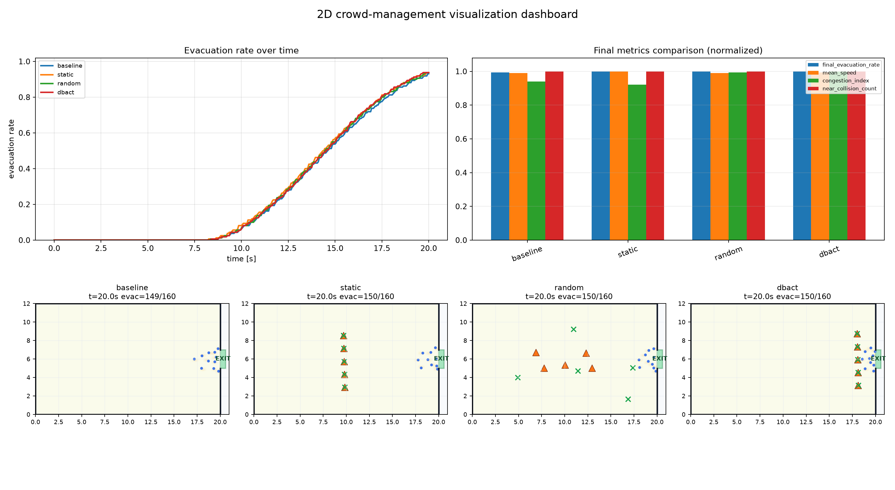
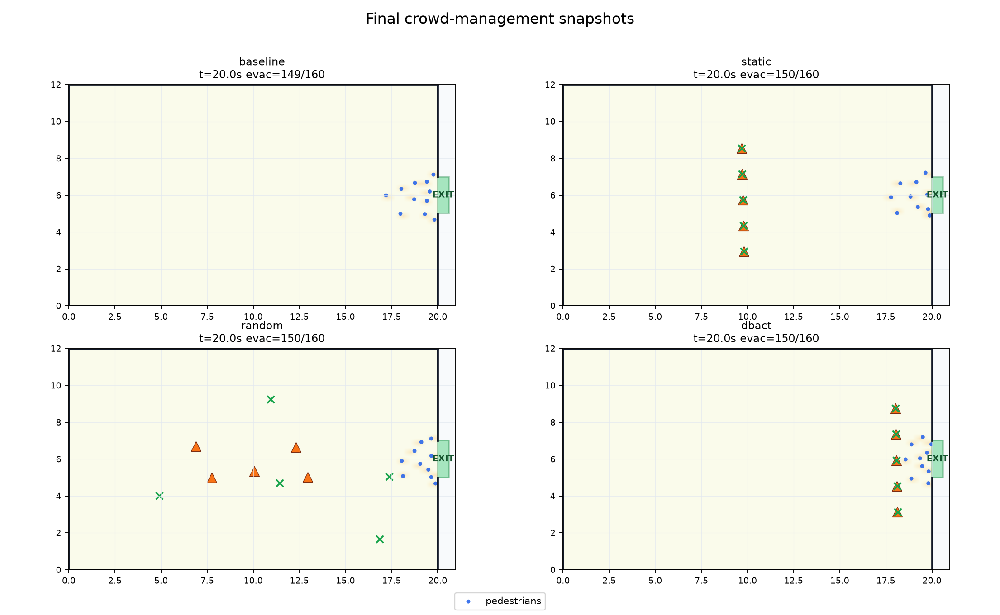
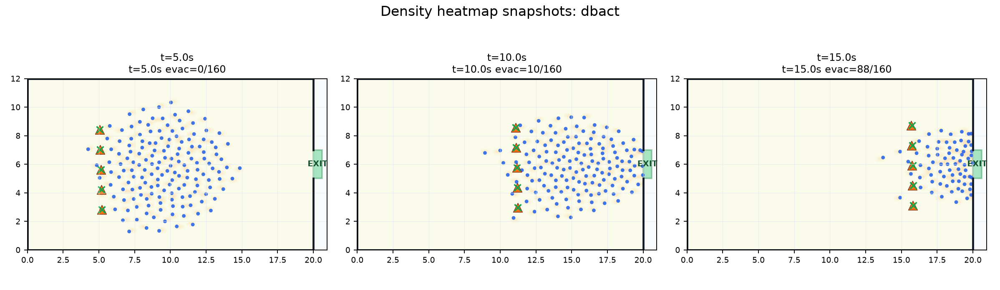
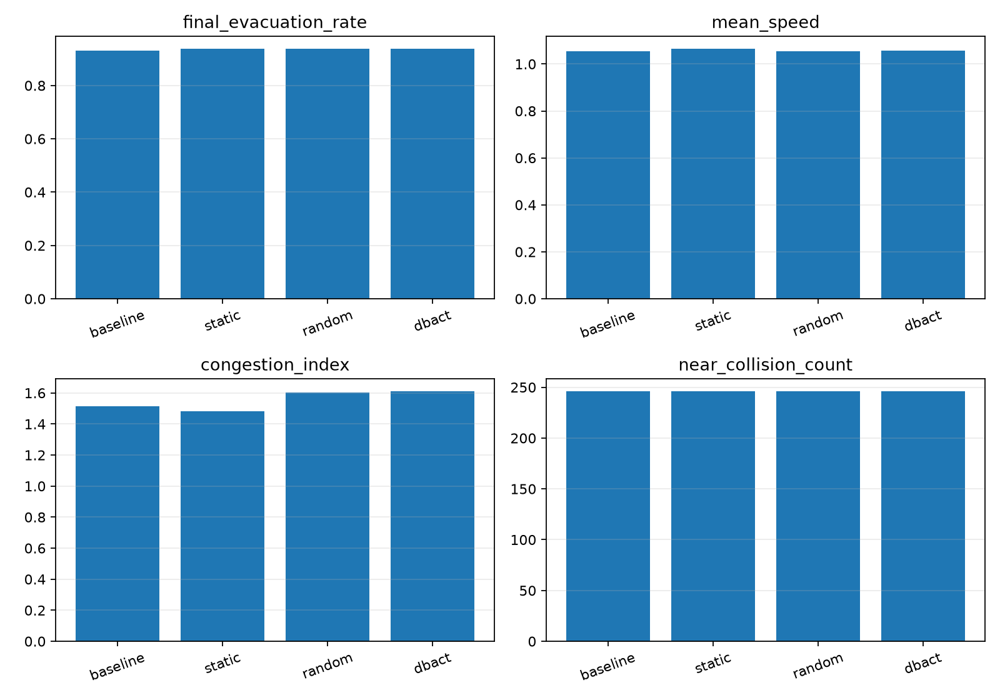

<div align="center">

# 群衆管理シミュレーション・プロトタイプ

再現可能な 2D 避難シミュレーション、評価指標、レポート、可視化成果をまとめた研究用プロトタイプ。

[English](README.md) | [繁體中文](README.zh-TW.md) | [日本語](README.ja.md)


</div>

Crowd Management Simulation Prototype は、より大きな実システムに進む前に、群衆避難の誘導アイデアを検証するための軽量な研究用シミュレータです。微視的な歩行者運動、移動ガイダーの影響、出口選択、密度を考慮した分流、再現可能な評価、発表向けの可視化を中心にしています。

> このリポジトリは研究プロトタイプであり、実世界データで校正済みの運用システムではありません。

---

## ビジュアルショーケース


> `reports/media/` にコミット済みの GIF です。ローカルの `runs/` ディレクトリに依存しないため、GitHub README 上で直接表示できます。



> 複数の誘導モードについて、避難率曲線、正規化された指標、最終スナップショットをまとめたダッシュボードです。

---

## メディアギャラリー

以下の画像と GIF はすべてコミット済みの `reports/` 配下を参照しているため、GitHub でそのまま表示できます。

| アニメーション | ダッシュボード |
| --- | --- |
|  |  |

| 最終スナップショット | 密度ヒートマップ |
| --- | --- |
|  |  |

| 避難率曲線 | 最終指標 |
| --- | --- |
|  |  |

MP4 動画はスクリプトで生成できますが、標準では `runs/` に保存され、Git では追跡しません。GitHub README で安定して表示したい場合は、コミット済みの GIF/PNG を使うか、大きな動画を GitHub Releases で公開してください。

---

## プロジェクト概要

| 項目 | 内容 |
| --- | --- |
| プロジェクト名 | Crowd Management Simulation Prototype |
| 目的 | 制御された 2D 避難シナリオで、群衆誘導戦略を比較すること。 |
| 技術スタック | Python 3.12、NumPy、PyYAML、Matplotlib、imageio-ffmpeg、Pytest |
| 主なシナリオ | `simple_room.yaml`、`two_exits.yaml`、`two_exit_bottleneck.yaml` |
| 出力 | CSV 指標、JSON サマリー、replay ファイル、PNG 図、GIF アニメーション、Markdown レポート |

---

## 主な特徴

- **微視的な群衆シミュレーション**：各歩行者は位置、速度、希望速度、従順度、目標出口、避難状態を持ちます。
- **複数の誘導モード**：baseline、static、random、DBACT-style、nearest-exit、balanced split-flow、density-only、pressure-only、density-aware DBACT を比較できます。
- **再現可能な評価**：単発実験、複数 seed の集計、Stage 4 の公平なベースライン、アブレーション、複合スコアを提供します。
- **可視化中心のワークフロー**：スナップショット、ヒートマップ、ダッシュボード、同期比較、アニメーション、レポート用図を生成します。
- **テスト済み CLI パイプライン**：シミュレーション、密度感知誘導、可視化パッケージ、複数 seed 評価、Stage 4 smoke workflow をテストしています。

---

## 実験結果と可視化

### Stage 4 密度感知 DBACT 評価

最新の Stage 4 レポートでは、`configs/two_exit_bottleneck.yaml` を使い、10 個の seed で 9 種類のモードを評価しています。

| Mode | Evacuation Rate | Congestion | Cumulative Congestion | Alternate-exit Usage | Exit Imbalance | Composite Score |
| --- | ---: | ---: | ---: | ---: | ---: | ---: |
| `baseline` | 0.9994 | 2.2056 | 85.4368 | 0.0000 | 1.0000 | 0.3592 |
| `static` | 0.9994 | 2.2033 | 84.5823 | 0.0000 | 1.0000 | 0.3635 |
| `dbact` | 1.0000 | 2.4961 | 92.3552 | 0.0000 | 1.0000 | 0.2819 |
| `nearest_exit` | 1.0000 | 1.8076 | 68.0892 | 0.1559 | 0.6881 | 0.5650 |
| `balanced_exit_static` | 0.9997 | 1.4810 | 53.2548 | 0.5002 | 0.0222 | 0.8177 |
| `density_only` | 0.9997 | 1.1949 | 41.6274 | 0.4889 | 0.0266 | 0.9156 |
| `exit_pressure_only` | 0.9722 | 1.5553 | 62.2892 | 0.6686 | 0.3372 | 0.6741 |
| `split_flow_only` | 0.9997 | 1.4810 | 53.2548 | 0.5002 | 0.0222 | 0.8177 |
| `density_dbact` | 0.9928 | 1.5474 | 61.9751 | 0.6912 | 0.3824 | 0.6883 |

**読み取り方**

- 現時点で最も強いスコアは、`density_only` のような単純で公平な出口割り当てベースラインから出ています。
- `density_dbact` は代替出口の利用と分流を可視化できますが、現在のパラメータでは最も強い単純なアブレーションをまだ上回っていません。
- 複合スコアは探索的な指標です。避難率、混雑、累積混雑、出口利用率、可視化された挙動と合わせて読む必要があります。

---

## クイックスタート

### 1. リポジトリを取得

```bash
git clone https://github.com/Wu-kaixin/Crowd-Management.git
cd Crowd-Management
```

### 2. 環境を作成

Windows PowerShell:

```powershell
python -m venv .venv
.\.venv\Scripts\Activate.ps1
python -m pip install -U pip
python -m pip install -e ".[dev]"
```

macOS / Linux:

```bash
python -m venv .venv
source .venv/bin/activate
python -m pip install -U pip
python -m pip install -e ".[dev]"
```

Conda:

```bash
conda env create -f environment.yml
conda activate C-M
```

### 3. 1 行で smoke experiment を実行

```bash
python scripts/run_density_dbact_experiment.py --config configs/two_exit_bottleneck.yaml --modes baseline density_dbact --steps 20 --seed 0 --output runs/quick_density_dbact --skip-video --fast-test
```

主な出力:

- `runs/quick_density_dbact/summary/metrics_summary.csv`
- `runs/quick_density_dbact/summary/DENSITY_DBACT_REPORT.md`
- `runs/quick_density_dbact/comparison/final_metrics_bar.png`
- `runs/quick_density_dbact/comparison/exit_usage_curve.png`

---

## 仕組み

1. **シナリオ設定を読み込む**
   YAML ファイルで、部屋のサイズ、出口、歩行者数、速度分布、従順度、ガイダー数、評価半径を定義します。

2. **歩行者エージェントを初期化する**
   群衆を剛体として扱わず、個別に分析できる歩行者 agent の集合として作成します。

3. **微視的な運動を進める**
   各ステップで、目標出口への誘引、歩行者間反発、壁処理、ノイズ、任意のガイダー影響を組み合わせます。

4. **誘導戦略を更新する**
   `dbact` は群衆中心と広がりを推定し、ガイダー位置を決めます。`density_dbact` はさらに出口圧力を推定し、一部の従順な歩行者を代替出口へ誘導します。

5. **replay と指標を保存する**
   各 run は `metrics.json`、`timeseries.csv`、`trajectories.npz`、`replay.npz` を保存するため、再シミュレーションなしで可視化できます。

6. **可視化成果を生成する**
   PNG、GIF、ダッシュボード、横並び比較、Markdown レポートを生成します。

---

## リポジトリ構成

```text
Crowd-Management/
|-- configs/                         # シナリオ設定
|-- src/crowd_management/             # シミュレータ、制御器、指標、replay、可視化
|-- scripts/                          # 実験とレンダリングの CLI
|-- reports/                          # コミット済みレポートと GitHub 表示用メディア
|   |-- media/                        # README 用 GIF
|   |-- visualization_upgrade_v1/      # ダッシュボード、ヒートマップ、最終スナップショット
|   |-- guidance_baselines_v1/         # ベースライン比較図と指標
|   `-- stage4_density_eval_v1/        # Stage 4 集計 CSV とレポート
|-- runs/                             # ローカル生成結果、Git では無視
|-- outputs/                          # 簡易出力、.gitkeep のみ追跡
|-- tests/                            # テスト
|-- README.md
|-- README.zh-TW.md
`-- README.ja.md
```

---

## よく使うコマンド

```bash
python scripts/run_baseline.py --config configs/simple_room.yaml --output outputs/baseline
python scripts/run_guided.py --config configs/simple_room.yaml --mode dbact --output outputs/dbact
python scripts/run_visualization_package.py --config configs/simple_room.yaml --modes baseline static random dbact --steps 400 --seed 0 --output runs/visualization_package_v1 --quality high
pytest --basetemp=.tmp/pytest-temp -o cache_dir=.tmp/pytest-cache
```

---

## 現在の研究方向

次に重要なのは、無関係な大規模機能を追加することではなく、検証とパラメータ探索です。従順度、ガイダー影響半径、密度重み、出口圧力重み、より難しいボトルネック形状、経路選択効果とガイダー配置効果の分離を優先します。

---

## コントリビューションとライセンス

Issue や Pull Request による貢献を歓迎します。新しいシナリオ、指標、可視化、より厳密な検証実験は特に有用です。

本プロジェクトは [MIT License](LICENSE) のもとで公開されています。
