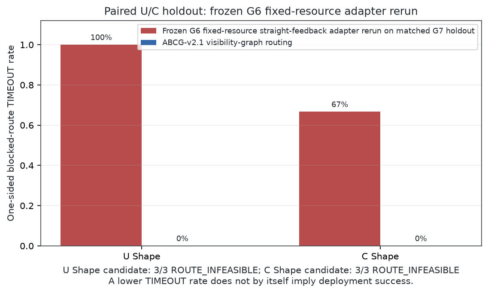
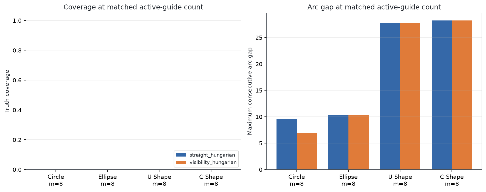
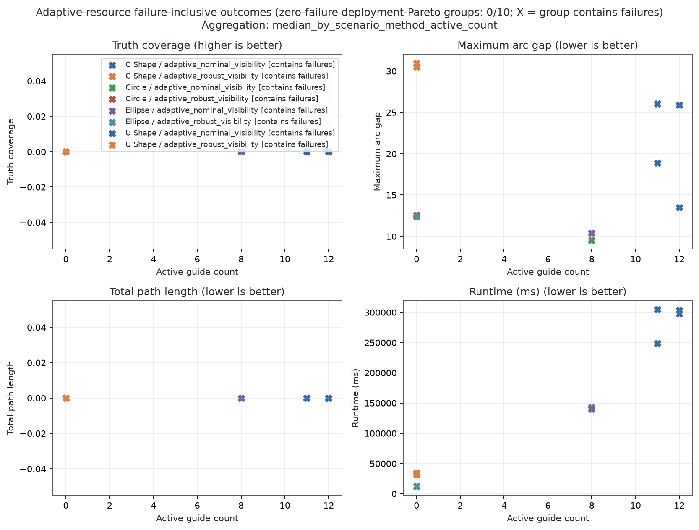
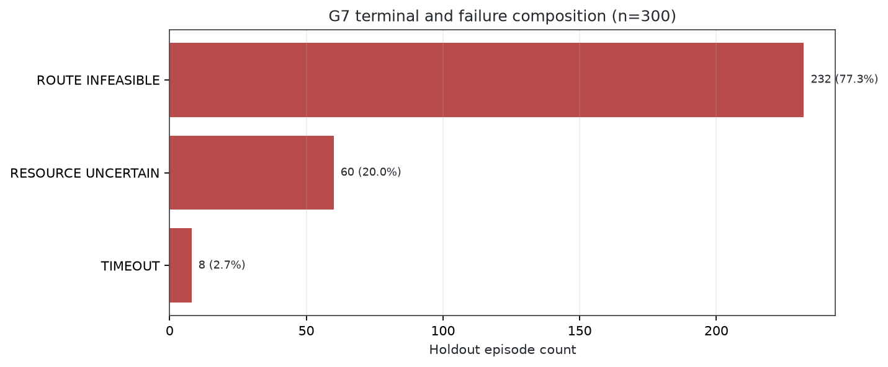
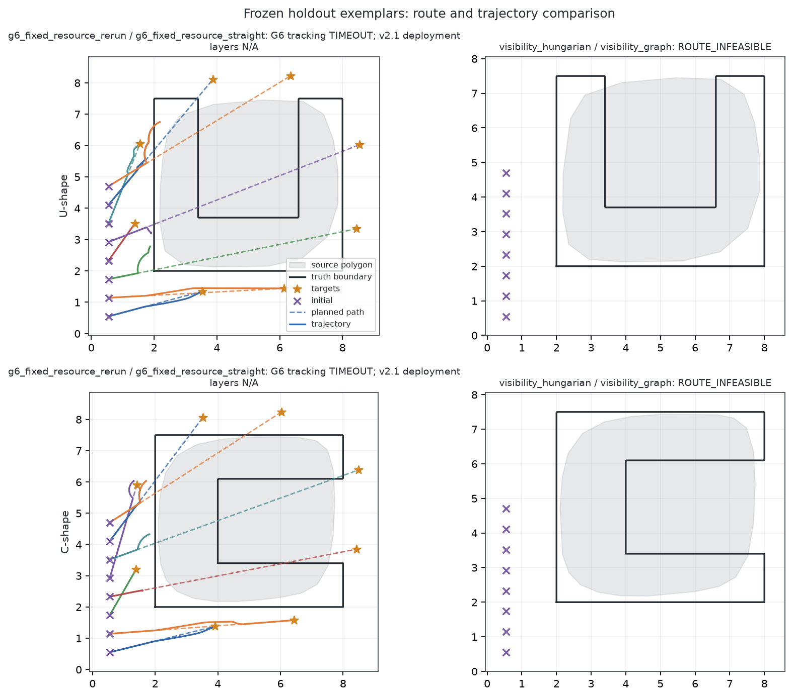
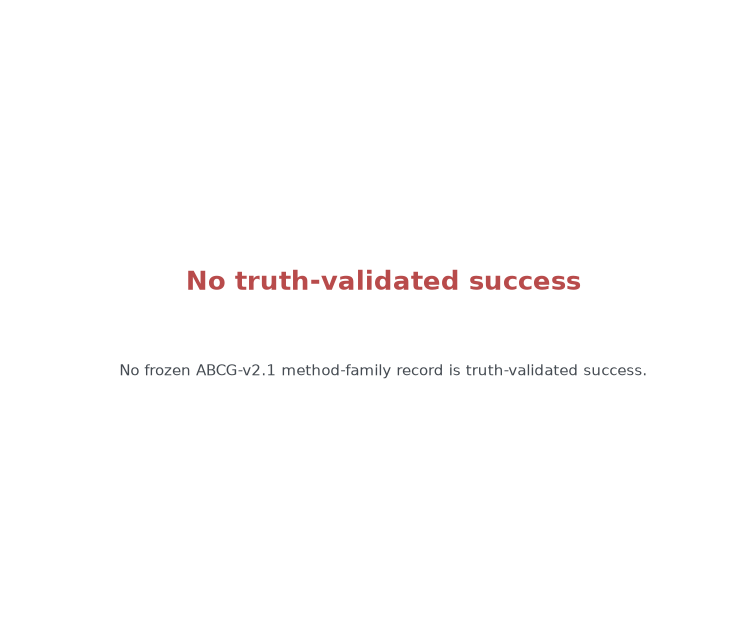
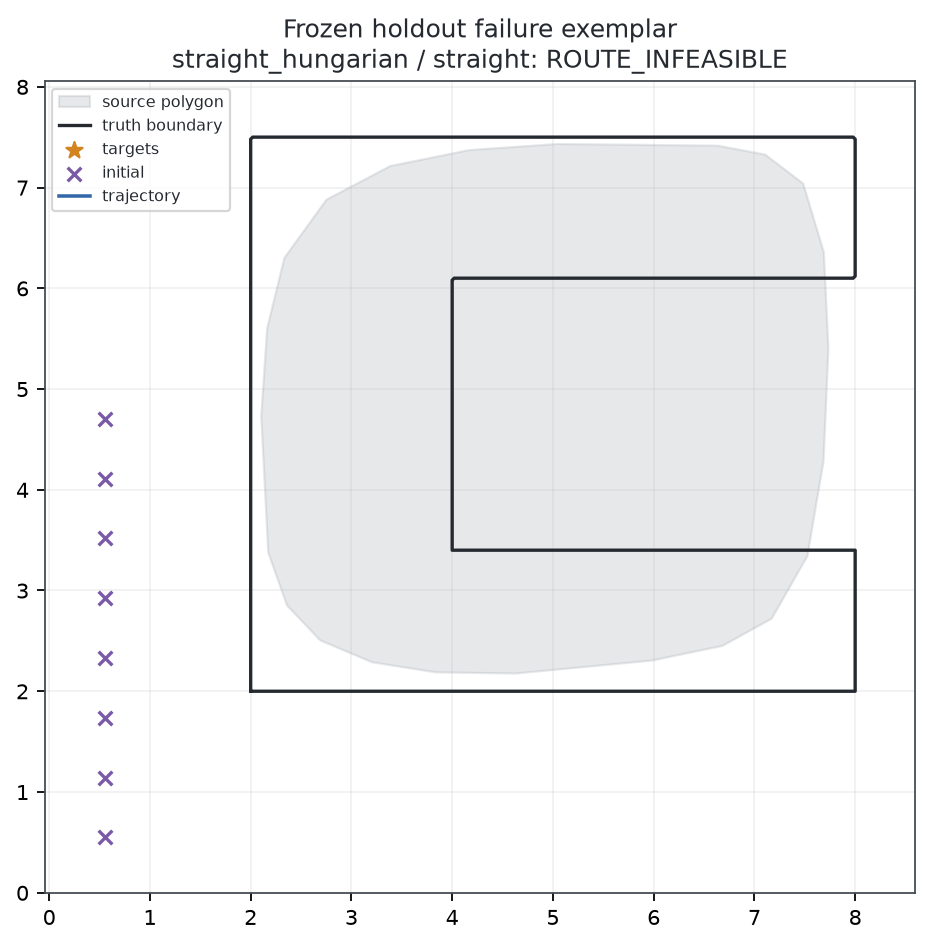

<div align="center">

# Crowd Management

Research simulator for adaptive guide-agent deployment around unknown crowds.

[English](README.md) | [Traditional Chinese](README.zh-TW.md) | [Japanese](README.ja.md)


</div>

Crowd Management is a Python research prototype for studying how multiple guide agents can be deployed around an unknown crowd. The active scope is static containment: a crowd is represented as a point cloud, its boundary is estimated, and guide agents are placed around an offset safety boundary.

The current method family is **ABCG: Adaptive Boundary-Coverage Guidance**. It combines radial or alpha-shape boundary estimation, bootstrap uncertainty, periodic coverage planning, adaptive guide allocation, SciPy identity-preserving assignment, a measured-feedback `reset/step` velocity controller, and sampled-data velocity safety projection. PR0-PR6 and every G0-G6 gate were reproduced from the clean implementation freeze `f2494922b2431bfd9a37a247add8a79acfdc18ed`. That historical ABCG-v2 milestone remains reproducible, but the separate ABCG-v2.1 proof-strengthening evaluation finished with **G7 `FAIL`** and does not support a deployment claim.

Previous evacuation-guidance experiments are preserved as legacy baselines. They are available for reproducibility, but they are not the main project direction.

> This repository is a research prototype. It is not a calibrated crowd-safety product, deployment planner, or safety-certified control system.

---

## Visual Overview

The active media below shows ABCG static containment on circular, elliptical, irregular, and two-cluster point clouds.


Legacy evacuation, DBAct, and density-DBAct media are stored under `legacy/evacuation_guidance/` and are not used as the main README visuals.

---

## Step 1 Proof-Strengthening / ABCG-v2.1

The existing G6 Visual Overview above is intentionally preserved as historical evidence. The independently frozen ABCG-v2.1 holdout is a separate experiment with a stronger success contract, and its formal result is **G7 `FAIL`**.

Formal provenance is recorded in [the G7 report](reports/step1_g7/G7_REPORT.md) and compact evidence under `reports/step1_g7/`:

- frozen implementation SHA: `dc73866254136b1e14237483bc4c8a0934e8732f`;
- resolved-config SHA-256: `6e6a1459bcf845e5db6dd653d682f330cda66d4cef3ecba1df04aca4b7cb48ce`;
- compact-record SHA-256: `b8b5ddb9879c268e62447b89572b8dd8b9167f0096fdaa0b32099f1b88b91238`;
- 330 formal holdout records: 300 ABCG-v2.1 deployment records plus 30 tracking-only frozen-G6 comparator records, executed with 24 case workers.

Across the 300 ABCG-v2.1 deployment records, estimated deployment success was `0/300` and truth-validated success was `0/300`. All records remain accounted for: `ROUTE_INFEASIBLE=232/300`, `RESOURCE_UNCERTAIN=60/300`, and `TIMEOUT=8/300`. Independent calibration was `CALIBRATION_INSUFFICIENT`, the Holm-adjusted primary family did not pass, and primary inference for the continuous tracking-RMSE and minimum-intersample-clearance endpoints is forbidden because the required observations are insufficient.

The table below reports the frozen same-resource `visibility_hungarian` summaries. Both reported success layers are zero in every row.

| Scenario | n | Truth coverage | Maximum consecutive arc gap | Active guides | Estimated / truth success | Matched blocked supplement |
|---|---:|---:|---:|---:|---:|---|
| Circle | 6 | 0 | 6.8398098553 | 8 | 0/6 / 0/6 | Not applicable |
| Ellipse | 6 | 0 | 10.3715398151 | 8 | 0/6 / 0/6 | Not applicable |
| U shape | 9 | 0 | 27.8124019852 | 8 | 0/9 / 0/9 | 0/3 `TIMEOUT`, but 3/3 `ROUTE_INFEASIBLE` |
| C shape | 9 | 0 | 28.2337400284 | 8 | 0/9 / 0/9 | 0/3 `TIMEOUT`, but 3/3 `ROUTE_INFEASIBLE` |

On the six matched blocked U/C cases, the frozen-G6 comparator ended in `TIMEOUT` for `5/6`; the visibility-routing candidate ended in `TIMEOUT` for `0/6`, but all `6/6` candidate records were `ROUTE_INFEASIBLE`. Avoiding a timeout is therefore **not** a successful deployment. The older G6 `CONVERGED` label means controller tracking only. It is not directly comparable to ABCG-v2.1 estimated deployment success, which additionally requires an optimal plan, certified feasible routes, converged tracking, and sampled safety, or to truth-validated success, which adds evaluator-only truth coverage and arc-gap checks.







The frozen [resource-pareto JSON](reports/step1_g7/resource_pareto.json) uses the exploratory label `COMPARABLE` for failure-inclusive aggregates. That label must not be read as deployment comparability: the corrected figure marks such groups with `X`, and `0/10` aggregated groups are zero-failure groups. No deployment Pareto conclusion is permitted.





The following GIF is an explicit **no-truth-success placeholder** because no ABCG-v2.1 record achieved truth-validated success. It is not a success case or a selected positive exemplar.





After the formal run, renderer concavity handling, figure semantics, and Git-blob hashing were corrected without rerunning the holdout. The formal 330-record evidence therefore remains locked to `dc73866254136b1e14237483bc4c8a0934e8732f`; the corrected media does not retroactively change the frozen gate result.

These results cover guide deployment around one static synthetic point cloud only. They do not prove human containment, evacuation improvement, behavior change, dynamic- or multiple-crowd capability, continuous-time safety, deployment readiness, or safety certification. The sampled-data safety projection remains an auditable engineering filter, not an unconditional safety certificate.

---

## Active Research Scope

The current stage evaluates static unknown-crowd containment.

- **Input:** a static 2D crowd point cloud.
- **Estimator:** the preserved v1 radial estimator plus a PR6 alpha-shape estimator with adaptive radius/smoothing selection, ordered arc geometry, bootstrap uncertainty/confidence, normal offsets, and explicit invalid status.
- **Periodic planner:** PR2 provides deterministic equal-arc and confidence-gated periodic Lloyd plans with exact uniform-density `H`, cell masses, convergence history, and explicit invalid states.
- **Resources and assignment:** PR3 computes `ceil(L/g_req)`, applies count hysteresis and capacity clipping, keeps reserve guides explicit, and solves deterministic guide-target assignment with switch penalties.
- **Motion and safety controller:** PR4 supplies `u_nom = sat(k_p(z-p))` and explicit Euler integration. PR5 deterministically projects `u_nom` onto reachable guide-guide, guide-crowd, and room half-spaces together with per-guide speed balls. Every applied control, projection status, constraint count, type-specific maximum residual, and emergency stop is recorded.
- **Endpoint baselines:** ABCG weighted placement, random deployment, static circular deployment, and legacy center-radius deployment provide the PR4 initial positions.
- **Baselines:** random deployment, static circular deployment, and legacy center-radius deployment.
- **Evaluation:** analytic generator truth is isolated from every estimator and planner. Formal G6 uses circle, ellipse, held-out U/C shapes; five required methods; three initial layouts; 30 paired seeds; 30 boundary bootstrap replicas; radial/alpha/confidence/resource ablations; noise, dropout, and scale sweeps; double-cluster and narrow-neck stress cases; paired effect sizes; worst-5% statistics; real failure examples; and runtime/P95/memory evidence. Failed runs remain in the denominator.
- **Proof-strengthening:** ABCG-v2.1 adds analytic-arc planning, uncertainty-aware resources, route certification, waypoint tracking, dense sampled-safety checks, independent calibration, and a frozen holdout protocol. Its formal G7 result is `FAIL`; all 300 v2.1 deployment failures remain in the denominator.
- **Metrics:** primary containment metrics use the final episode frame; initial endpoint coverage and maximum Euclidean boundary distance are retained separately for audit. Safety-filter convergence and containment efficacy are reported separately: a feasible safety projection does not imply that an unsafe fixed target can be reached.

The authoritative PR0-PR6 scope and Gate definitions are in [docs/RESEARCH_SPEC.md](docs/RESEARCH_SPEC.md).

ABCG-v2.1 has not cleared G7. Dynamic crowds, behavior response, local collision avoidance, and evacuation scenarios remain future research rather than validated extensions of the present result.

---

## Quick Start

Create or update the conda environment:

```bash
conda env update -n abcg -f environment.yml
conda activate abcg
```

Run the main static containment experiment:

```bash
python scripts/run_static_containment.py --config configs/static_crowd_circle.yaml --output runs/static_containment_circle --methods random static_circle legacy_center_radius abcg
```

Important outputs:

- `runs/static_containment_circle/summary.json`
- `runs/static_containment_circle/summary.csv`
- `runs/static_containment_circle/manifest.json`
- `runs/static_containment_circle/config_resolved.yaml`
- `runs/static_containment_circle/crowd_truth.npz`
- `runs/static_containment_circle/boundary_v2_status.json`
- `runs/static_containment_circle/boundary_v2.npz` when geometry is valid
- `runs/static_containment_circle/periodic_plan_status.json`
- `runs/static_containment_circle/periodic_plan.npz` when the PR2 plan is valid and converged
- `runs/static_containment_circle/resource_decision.json`
- `runs/static_containment_circle/<method>/assignment_status.json`
- `runs/static_containment_circle/<method>/assignment.npz` unless assignment is skipped or infeasible
- `runs/static_containment_circle/<method>/episode_status.json`
- `runs/static_containment_circle/<method>/episode.npz` when a finite episode trace exists, including PR5 per-frame safety arrays
- `runs/static_containment_circle/abcg/metrics.json`
- `runs/static_containment_circle/abcg/containment.png`

Regenerate README media:

```bash
python scripts/build_readme_media.py
```

Run tests:

```bash
pytest --basetemp=.tmp/pytest-temp -o cache_dir=.tmp/pytest-cache
```

Check dependency consistency:

```bash
python -m pip check
```

`No broken requirements found.` is pip's successful result, not an error.

Run the formal PR6/G6 closed-loop evaluation:

```bash
python scripts/run_step1_g6_compliance.py --output reports/step1_g6_compliance --run-root runs/step1_g6_compliance
```

The formal report is [reports/step1_g6_compliance/G6_COMPLIANCE_REPORT.md](reports/step1_g6_compliance/G6_COMPLIANCE_REPORT.md). The earlier boundary-only PR6 evaluator remains available as a compatibility diagnostic, but it is not sufficient by itself for formal G6. The committed compact evidence records `overall_status=PASS`, `frozen_commit=PASS`, and the exact evaluated implementation commit; raw trajectories and repeated records remain external reproducibility artifacts.

Run the ABCG-v2.1 G7 protocol in order. Freeze must be created from a committed clean tree, and a formal holdout must use the worker count recorded by that freeze:

```bash
python scripts/run_step1_g7.py --phase pilot --output runs/step1_g7/pilot
python scripts/run_step1_g7.py --phase calibration --output runs/step1_g7/calibration
python scripts/run_step1_g7.py --phase freeze --output runs/step1_g7/freeze --pilot-evidence runs/step1_g7/pilot/pilot_evidence.json --calibration-evidence runs/step1_g7/calibration/calibration_evidence.json
python scripts/run_step1_g7.py --phase holdout --output reports/step1_g7 --freeze-manifest runs/step1_g7/freeze/freeze_manifest.json --workers 24
python scripts/build_step1_g7_media.py --input reports/step1_g7 --output reports/media/step1_g7
```

The committed formal G7 result is the failed frozen evaluation summarized above. Reproducing a different code revision as formal evidence requires a new Pilot -> independent Calibration -> Freeze -> Holdout sequence.

---

## Repository Layout

```text
Crowd-Management/
|-- configs/                         # Active static containment scenarios
|-- docs/                            # Step 1 research contract and Gate status
|-- src/crowd_management/
|   |-- crowd/                        # Static crowd point-cloud generators
|   |-- geometry/                     # Closed-curve arc length and validity
|   |-- estimation/                   # Boundary and state estimation
|   |-- controllers/                  # ABCG, periodic CVT, resources, assignment, kinematics, and baselines
|   |-- controllers/abcg_v2.py        # ABCG-v2.1 route-aware deployment controller
|   |-- experiments/                  # Experiment runners
|   |-- evaluation/                   # PR6 compatibility and formal G6 evaluation
|   |-- legacy/evacuation/            # Archived evacuation implementation
|   |-- containment_metrics.py        # Static containment metrics
|   `-- containment_visualization.py  # Static containment plotting
|-- scripts/
|   |-- run_static_containment.py     # Main experiment CLI
|   |-- run_step1_pr6_evaluation.py   # Paired robust-evaluation CLI
|   |-- run_step1_g6_compliance.py    # Formal G6 closed-loop evaluation CLI
|   |-- run_step1_g7.py               # Frozen ABCG-v2.1 G7 protocol CLI
|   |-- build_step1_g7_media.py        # Failure-aware G7 README media
|   |-- build_readme_media.py         # README media generation
|   `-- legacy wrappers               # Compatibility wrappers for archived scripts
|-- reports/
|   |-- media/                        # Active ABCG media
|   |-- step1_pr6_evaluation/         # Earlier boundary-only PR6 diagnostic
|   |-- step1_g6_compliance/          # Formal compact G6 evidence and gallery
|   `-- step1_g7/                     # Frozen G7 report and compact evidence
|-- legacy/
|   `-- evacuation_guidance/           # Archived old configs, reports, media, and scripts
|-- tests/
|-- pyproject.toml
`-- README.md
```

---

## Legacy Archive

The earlier evacuation-guidance line is stored in:

```text
legacy/evacuation_guidance/
src/crowd_management/legacy/evacuation/
```

The archive contains old scenario files, reports, figures, GIF media, original script implementations, replay utilities, metrics, and evacuation controllers. Root-level compatibility wrappers remain for older commands, but new development should start from `scripts/run_static_containment.py`.

---

## Development Status

- Active branch: `step1-proof-strengthening-v1`.
- Active method family: ABCG static unknown-crowd containment.
- Historical status: ABCG-v2 reproduced G0-G6 from a clean checkout; the G6 freeze passed with all 600 primary records retained and its then-current suite reported `95 passed`.
- Current proof status: **ABCG-v2.1 G7 `FAIL`** on the frozen 330-record holdout; estimated and truth-validated deployment success were both `0/300`.
- Final post-Holdout code/report validation: **279 passed in 154.16s**, plus compileall, dependency, diff, clean-checkout media, and frozen-G6 hash checks.
- Main committed media: PNG and GIF artifacts under `reports/media/`.

The historical G6 milestone was deliberately narrow, and the stronger G7 gate
did not pass. Neither result proves human compliance, containment
effectiveness, evacuation improvement, behavioral change, dynamic or
multiple-crowd applicability, deployment readiness, continuous-time safety,
or safety certification. All failure states remain research results.

## License

This project is released under the [MIT License](LICENSE).
