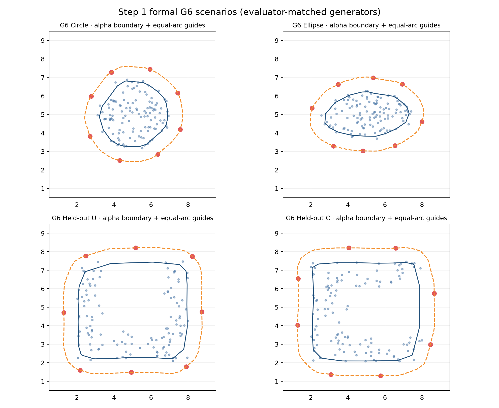
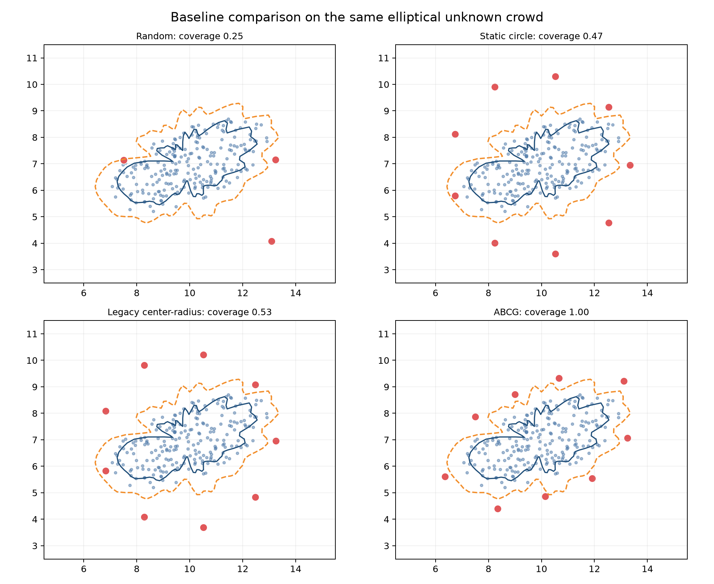
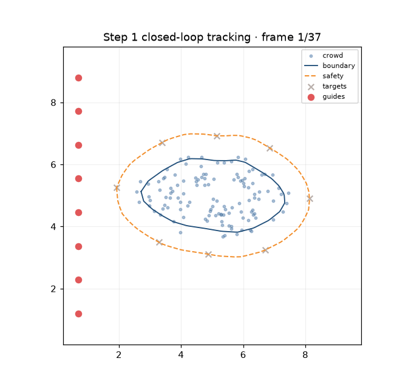
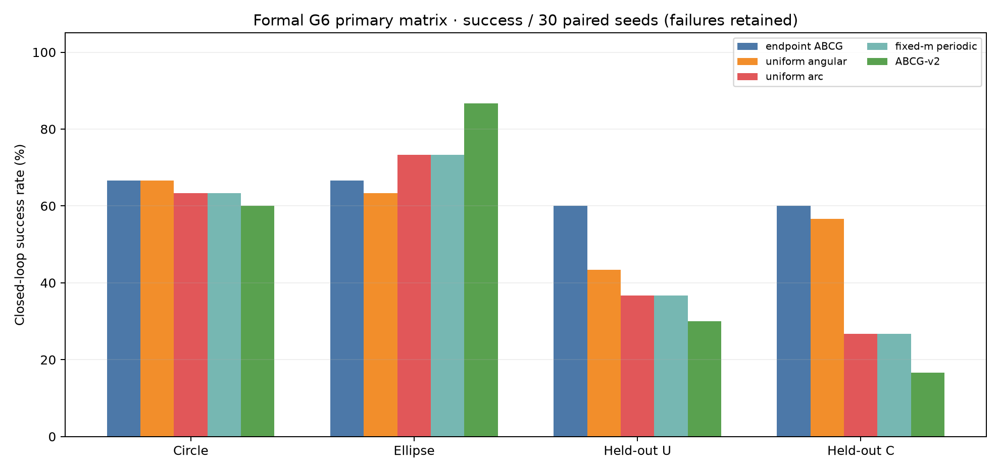
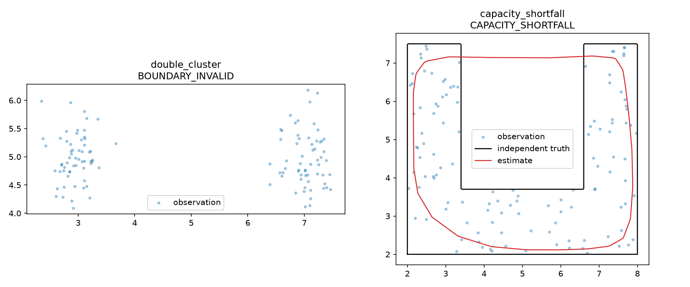
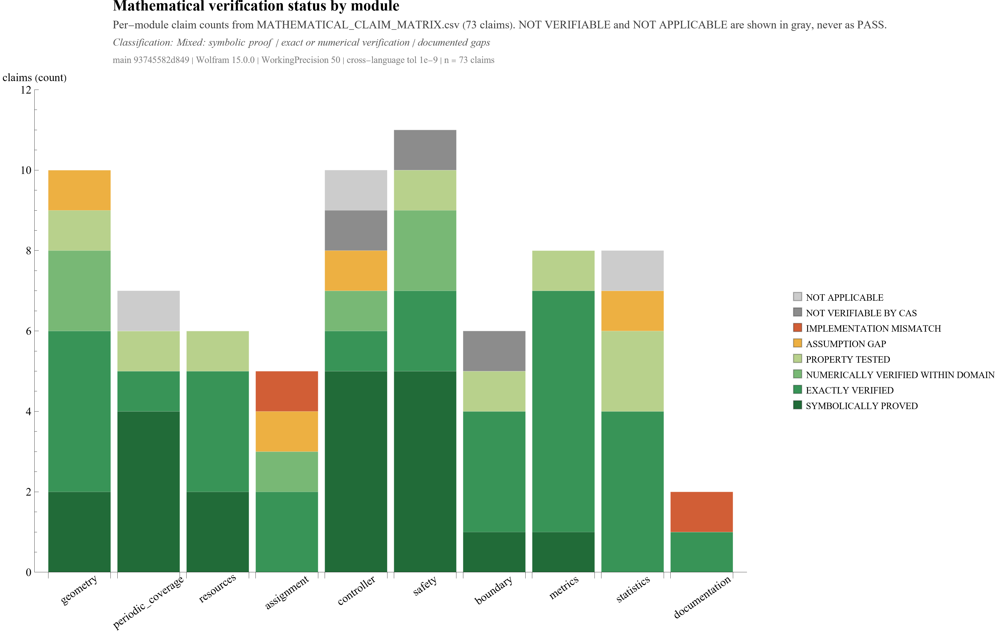

<div align="center">

# Crowd Management

Research simulator for adaptive guide-agent deployment around unknown crowds.

[English](README.md) | [Traditional Chinese](README.zh-TW.md) | [Japanese](README.ja.md)


</div>

Crowd Management is a Python research prototype for **static unknown-crowd containment**. A crowd is a 2D point cloud; the simulator estimates its boundary and places guide agents around an offset safety curve.

The active method family is **ABCG: Adaptive Boundary-Coverage Guidance** (boundary estimation, periodic coverage planning, adaptive resources, identity-preserving assignment, measured-feedback velocity control, and sampled-data safety projection). From freeze `f2494922b2431bfd9a37a247add8a79acfdc18ed`, PR0–PR6 and G0–G6 all pass. **ABCG-v2 Step 1 is research-complete** for that narrow static scope.

Evacuation / DBAct / density-DBAct code is **not** on `main`. It lives on [`local-main-backup`](https://github.com/Wu-kaixin/Crowd-Management/tree/local-main-backup) for reproducibility only.

> Research prototype only — not a calibrated safety product or certified controller.

---

## Visual Overview

Regenerate media with `python scripts/build_readme_media.py`.

### Static containment examples


### Formal G6 scenarios



### Baseline comparison



### Closed-loop tracking



### Formal G6 evidence





Write-up: [G6_COMPLIANCE_REPORT.md](reports/step1_g6_compliance/G6_COMPLIANCE_REPORT.md).

---

## Mathematical Verification

Core mathematical identities and selected implementation properties were independently checked with Wolfram Language under explicitly stated assumptions. This does not validate crowd-behavior assumptions, human compliance, real-world effectiveness, or deployment safety.

- Audit basis: `main` @ `93745582d849`, Mathematica 15.0.0 (local kernel via `wolframscript`; nothing is executed in public CI).
- 74 Wolfram `VerificationTest`s, 74 passed; 73 catalogued claims: 20 symbolically proved, 27 exactly verified, 6 numerically verified within domain, 8 property-tested, and 12 explicitly documented as gaps, doc mismatches, not CAS-verifiable, or not applicable — never presented as proven.
- Max Python-vs-Wolfram relative deviation over 38 paired recomputations: 5.6e-16 (frozen tolerance 1e-9); safety-projection KKT residuals ≤ 3e-17 at 50-digit certified reference solutions.



Full report: [docs/math/MATHEMATICAL_VERIFICATION_REPORT.md](docs/math/MATHEMATICAL_VERIFICATION_REPORT.md). Claim-by-claim evidence: [docs/math/MATHEMATICAL_CLAIM_MATRIX.md](docs/math/MATHEMATICAL_CLAIM_MATRIX.md). Machine-readable artifacts live under `artifacts/math_verification/`, and CI only re-checks artifact hashes and SHA freshness (`scripts/check_math_verification_freshness.py`); it never claims to re-run Mathematica.

---

## Active Research Scope

- **Input:** static 2D crowd point cloud.
- **Estimator:** v1 radial + PR6 alpha-shape with bootstrap confidence and explicit invalid states.
- **Planner:** equal-arc / confidence-gated periodic Lloyd (PR2).
- **Resources & assignment:** `ceil(L/g_req)`, hysteresis, reserves, switch-penalty assignment (PR3).
- **Motion & safety:** `u_nom = sat(k_p(z-p))` with sampled-data half-space projection (PR4/PR5).
- **Baselines:** random, static circle, legacy center-radius, endpoint ABCG.
- **Evaluation:** independent analytic truth; formal G6 paired seeds; failures stay in the denominator.

Authoritative contract: [docs/RESEARCH_SPEC.md](docs/RESEARCH_SPEC.md).

---

## Quick Start

```bash
conda env update -n abcg -f environment.yml
conda activate abcg
```

Static containment:

```bash
python scripts/run_static_containment.py \
  --config configs/static_crowd_circle.yaml \
  --output runs/static_containment_circle \
  --methods random static_circle legacy_center_radius abcg
```

Typical outputs under the run directory: `summary.json`, `manifest.json`, `crowd_truth.npz`, boundary/plan/resource artifacts, and per-method assignment/episode files.

Tests and dependency check:

```bash
mkdir -p .tmp
pytest --basetemp=.tmp/pytest-temp -o cache_dir=.tmp/pytest-cache
python -m pip check
```

Formal G6:

```bash
python scripts/run_step1_g6_compliance.py \
  --output reports/step1_g6_compliance \
  --run-root runs/step1_g6_compliance
```

Paired PR6 diagnostic (boundary/confidence; not a full G6 substitute):

```bash
python scripts/run_step1_pr6_evaluation.py --output reports/step1_pr6_evaluation
```

CI smoke (tiny deterministic workload):

```bash
python scripts/run_ci_smoke.py --output artifacts/ci_smoke
```

README consistency gate:

```bash
python scripts/check_readme_consistency.py
```

---

## Repository Layout

```text
Crowd-Management/
|-- configs/                    # Scenarios + configs/ci_smoke.yaml
|-- docs/                       # RESEARCH_SPEC, architecture, performance
|-- src/crowd_management/
|   |-- crowd/                  # Generators + truth
|   |-- geometry/               # Arc-length / validity
|   |-- estimation/             # Boundary estimators
|   |-- controllers/            # ABCG math controllers (stable cores)
|   |-- runtime/                # Hardware-aware workers / executor
|   |-- reporting/              # Shared JSON + snapshot I/O
|   |-- experiments/            # Static containment runner package
|   |-- evaluation/             # G6 / PR6 packages + schema validation
|   |-- containment_metrics.py
|   `-- containment_visualization.py
|-- scripts/                    # Thin CLIs (static / PR6 / G6 / smoke / CI checks)
|-- .github/workflows/ci.yml    # Linux + Windows CI
|-- reports/                    # Frozen G6/PR6 evidence + README media
|-- tests/                      # Unit, regression, smoke
|-- pyproject.toml
`-- README.md
```

---

## Legacy Archive

```text
local-main-backup:legacy/evacuation_guidance/
local-main-backup:src/crowd_management/legacy/
```

Inspect with `git switch local-main-backup`. New work starts from `scripts/run_static_containment.py` on `main`.

---

## Development Status

- Branch: **`main`**
- Method family: ABCG static unknown-crowd containment
- Step 1: **research-complete** (G0–G6 from the freeze above)
- Suite size (authoritative; synced by `scripts/check_readme_consistency.py`):
  <!-- TEST_COUNT_START -->
  179
  <!-- TEST_COUNT_END -->
- CI: Linux + Windows via [`.github/workflows/ci.yml`](.github/workflows/ci.yml) (unit tests, scoped lint/type-check, README consistency, deterministic smoke, schema regression)
- Formal G6: 600 primary records retained — [G6 report](reports/step1_g6_compliance/G6_COMPLIANCE_REPORT.md)
- Local performance notes: [docs/performance/final_report.md](docs/performance/final_report.md) (CI wall times are **not** formal evidence)
- Architecture maintenance notes: [docs/architecture/refactor_result.md](docs/architecture/refactor_result.md)

Research-complete means simulated guide deployment around one static unknown crowd. It does **not** prove human compliance, real-world containment, evacuation gain, multi-crowd dynamics, or continuous-time safety certificates.

## License

[MIT License](LICENSE).
