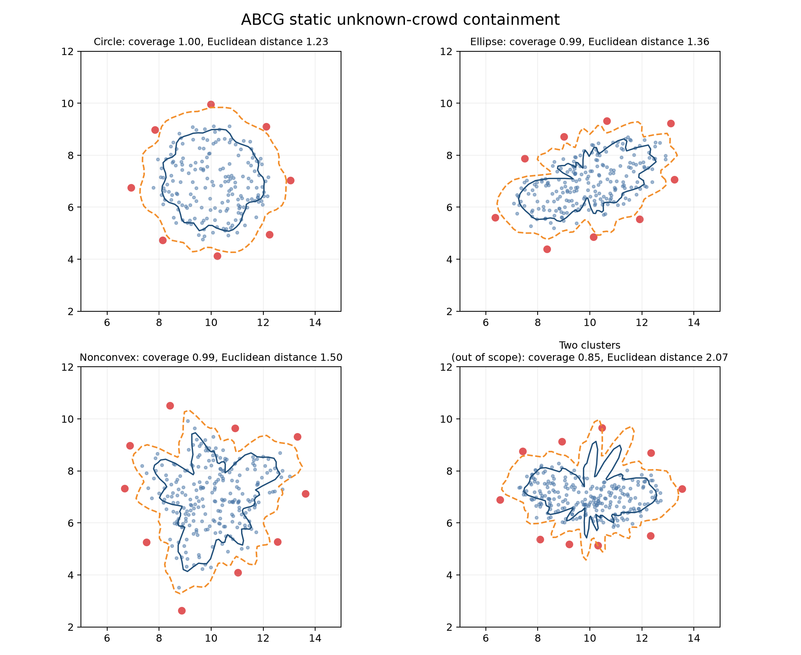
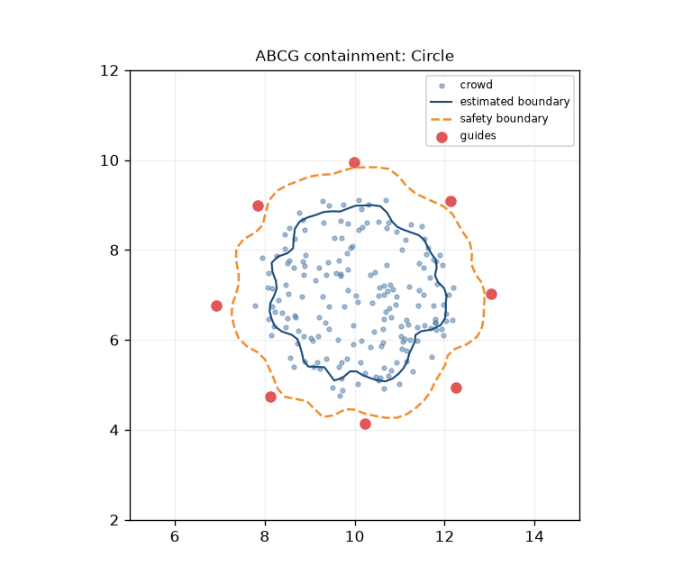
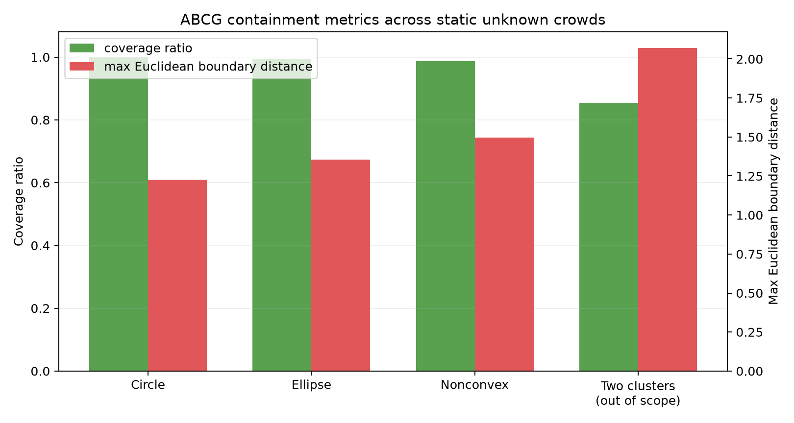
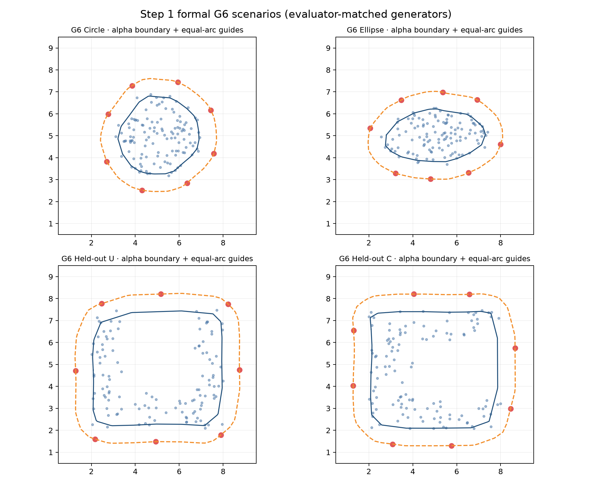
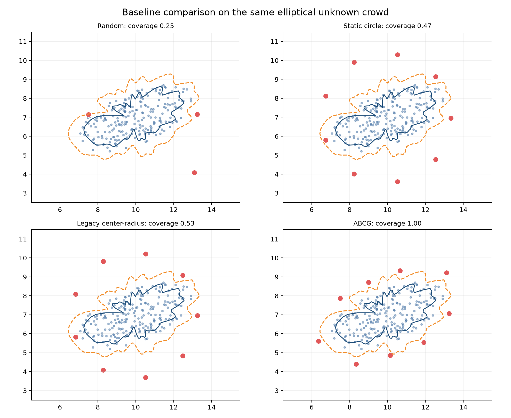
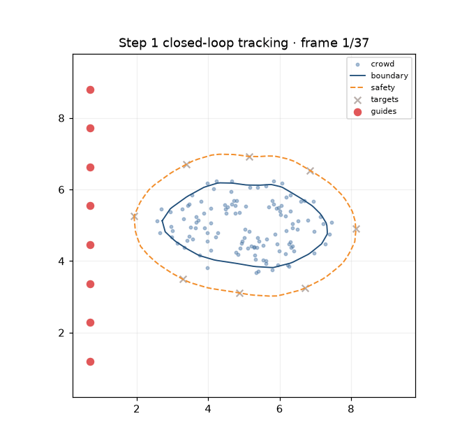
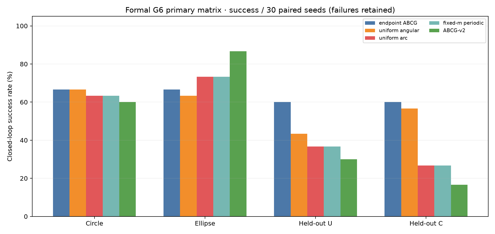
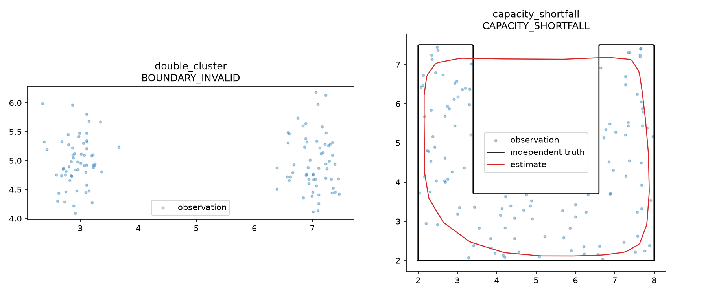
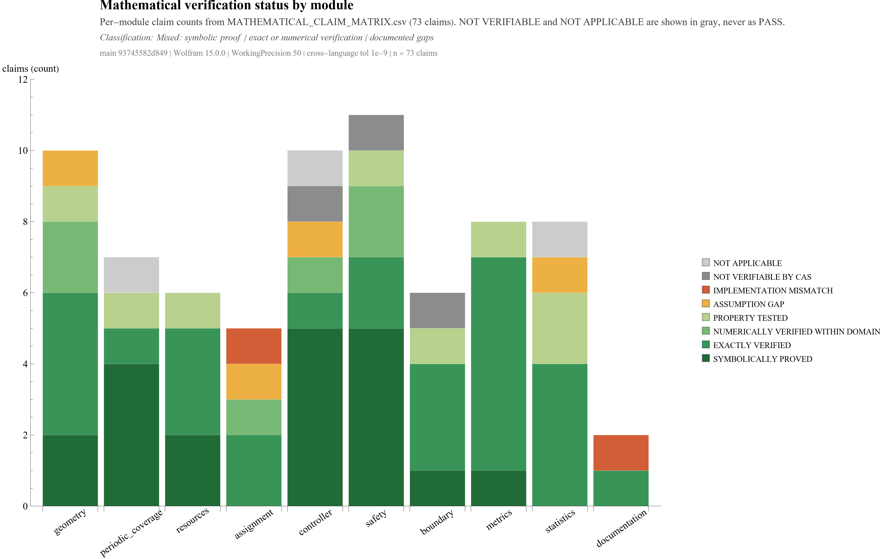

<div align="center">

# Crowd Management

Research simulator for adaptive guide-agent deployment around unknown crowds.

[English](README.md) | [Traditional Chinese](README.zh-TW.md) | [Japanese](README.ja.md)


</div>

This document describes branch **`feature/jupedsim-step1`**, not a frozen `main` release note.

Crowd Management remains a Python research prototype for **static unknown-crowd containment** (ABCG). On this branch the new work is a **JuPedSim-backed static crowd source** and a **paired synthetic↔JuPedSim Step-1 source-robustness evaluation**. JuPedSim is used only to place physically spaced pedestrian centres; **no pedestrian dynamics are advanced** in Step 1.

> Research prototype only — not a calibrated safety product or certified controller.
> Local pairing evidence below is exploratory; it does **not** replace the frozen G6 research-complete claim on `main` @ `f2494922…`.

---

## What this branch changes

| Area | Status on this branch |
| --- | --- |
| Crowd source | `crowd.source: synthetic \| jupedsim` (static point clouds) |
| JuPedSim role | Spawn centres inside a polygon with spacing constraints; evaluator-only truth from centre-support geometry |
| Benchmarks | `configs/step1_benchmark/` (circle / ellipse / irregular pairs + concave pressure case) |
| Evaluation | `scripts/run_step1_source_pairing.py` + `scripts/analyze_step1_source_pairing.py` |
| Frozen G6 / PR6 on `main` | Still the Step-1 research-complete baseline; **not re-run / not re-frozen here** |

Entry points:

```bash
# JuPedSim static smoke
python scripts/jupedsim_static_smoke.py

# Paired source evaluation (synthetic vs JuPedSim)
python scripts/run_step1_source_pairing.py \
  --output reports/step1_source_pairing

python scripts/analyze_step1_source_pairing.py \
  --records reports/step1_source_pairing/records.csv \
  --output reports/step1_source_pairing
```

---

## Local paired results (this worktree)

Frozen local evidence under [`reports/step1_source_pairing/`](reports/step1_source_pairing/):

- Matrix: **3 shapes × 2 sources × 20 seeds = 120** ABCG runs
- Shapes: `circle`, `ellipse`, `irregular`
- Sources: `synthetic` vs `jupedsim` (nominally matched geometry / count / room / controller; **not** identical point-process distributions)
- Failure policy: invalid / timeout / skipped stages **remain in the denominator**
- Pipeline launch success: **120/120** (`run_success=True`) — every case produced artifacts
- Closed-loop episode outcomes are **not** all successes (see below)

### Episode and boundary outcomes

| Source | `BOUNDARY_INVALID` | `VALID` boundary | `CONVERGED` | `TIMEOUT` |
| --- | ---: | ---: | ---: | ---: |
| synthetic (n=60) | 39 | 21 | 11 | 10 |
| jupedsim (n=60) | 23 | 37 | 32 | 5 |
| **all (n=120)** | **62** | **58** | **43** | **15** |

By shape / source (boundary validity):

| Pair | synthetic VALID | jupedsim VALID |
| --- | ---: | ---: |
| circle | 7/20 | 16/20 |
| ellipse | 7/20 | 13/20 |
| irregular | 7/20 | 8/20 |

Interpretation in one line: under these benchmark configs, JuPedSim static placements yield a **higher alpha-boundary acceptance rate** than the matched synthetic generator, and more `CONVERGED` episodes — but irregular geometry remains hard for both sources, and many “successful launches” still end as `BOUNDARY_INVALID` or `TIMEOUT`.

### `BOUNDARY_INVALID` — what actually failed

Of the **62** invalid boundaries (from `boundary_v2_status.json` diagnostics):

| Reason | Count | Meaning |
| --- | ---: | --- |
| `alpha_insufficient_observation_coverage` | 61 | Alpha-shape candidate existed, but observation coverage stayed below the acceptance gate (`min_observation_coverage=0.8`, with a slightly higher selection threshold during radius search) |
| `multiple_significant_components` | 1 | Observation connectivity split into more than one significant component (out-of-scope for single-component Step 1) |

When boundary is invalid the runner **does not invent a boundary**: periodic planning is skipped (`PLAN_SKIPPED_BOUNDARY_INVALID` / resource `RESOURCE_SKIPPED_BOUNDARY_INVALID`), and the episode status stays `BOUNDARY_INVALID`. That is intentional research accounting, not a silent repair.

Example diagnostic (irregular / synthetic / seed 0): `observation_coverage_ratio=0.90` on a raw candidate while the **resampled / acceptance** path still failed the gate → status `BOUNDARY_INVALID` with reason `alpha_insufficient_observation_coverage`.

### Metric deltas (paired, where both sides have numbers)

From [`analysis.json`](reports/step1_source_pairing/analysis.json) (JuPedSim − synthetic):

- **circle coverage**: mean Δ ≈ −0.028 (95% bootstrap CI ≈ [−0.048, −0.008]); JuPedSim slightly lower coverage when both run.
- **circle angular uniformity error**: mean Δ ≈ +0.117 (CI ≈ [0.056, 0.175]); JuPedSim worse uniformity on average.
- **circle / ellipse active guide count**: JuPedSim tends to activate **more** guides (circle mean Δ ≈ +3.7).
- Safety violation counts stayed **0** on both sources in this matrix; no `safety_infeasible` steps were recorded.

These are source-robustness diagnostics only. They do **not** prove JuPedSim dynamics, human compliance, or deployment safety.

Machine-readable tables: [`records.csv`](reports/step1_source_pairing/records.csv), [`aggregate.json`](reports/step1_source_pairing/aggregate.json), [`paired_deltas.csv`](reports/step1_source_pairing/paired_deltas.csv).

---

## Visual Overview (inherited from `main`)

Regenerate media with `python scripts/build_readme_media.py`. Figures below are the frozen Step-1 media from `main`; they are **not** regenerated from the JuPedSim pairing matrix above.

### Static containment examples







### Formal G6 scenarios



### Baseline comparison



### Closed-loop tracking



### Formal G6 evidence





Write-up: [G6_COMPLIANCE_REPORT.md](reports/step1_g6_compliance/G6_COMPLIANCE_REPORT.md).

---

## Mathematical Verification

Core mathematical identities and selected implementation properties were independently checked with Wolfram Language under explicitly stated assumptions. This does not validate crowd-behavior assumptions, human compliance, real-world effectiveness, or deployment safety.

- Audit basis: `main` @ `491759761e44`, Mathematica 15.0.1 (local Linux kernel; nothing is executed in public CI).
- 74 Wolfram `VerificationTest`s, 74 passed; 73 catalogued claims: 20 symbolically proved, 27 exactly verified, 6 numerically verified within domain, 8 property-tested, and 12 explicitly documented as gaps, doc mismatches, not CAS-verifiable, or not applicable — never presented as proven.
- Max Python-vs-Wolfram relative deviation over 38 paired recomputations: 5.6e-16 (frozen tolerance 1e-9); safety-projection KKT residuals ≤ 3e-17 at 50-digit certified reference solutions.



Full report: [docs/math/MATHEMATICAL_VERIFICATION_REPORT.md](docs/math/MATHEMATICAL_VERIFICATION_REPORT.md). Claim-by-claim evidence: [docs/math/MATHEMATICAL_CLAIM_MATRIX.md](docs/math/MATHEMATICAL_CLAIM_MATRIX.md). Machine-readable artifacts live under `artifacts/math_verification/`, and CI only re-checks artifact hashes and SHA freshness (`scripts/check_math_verification_freshness.py`); it never claims to re-run Mathematica.

---

## Active Research Scope

- **Input:** static 2D crowd point cloud (`synthetic` or `jupedsim` source on this branch).
- **Estimator:** v1 radial + PR6 alpha-shape with bootstrap confidence and explicit invalid states (`BOUNDARY_INVALID` / `OFFSET_INVALID`).
- **Planner:** equal-arc / confidence-gated periodic Lloyd (PR2); skipped when boundary is invalid.
- **Resources & assignment:** `ceil(L/g_req)`, hysteresis, reserves, switch-penalty assignment (PR3).
- **Motion & safety:** `u_nom = sat(k_p(z-p))` with sampled-data half-space projection (PR4/PR5).
- **Baselines:** random, static circle, legacy center-radius, endpoint ABCG.
- **Evaluation:** independent analytic truth; formal G6 paired seeds on `main`; source pairing on this branch; failures stay in the denominator.

Authoritative contract: [docs/RESEARCH_SPEC.md](docs/RESEARCH_SPEC.md).

---

## Quick Start

```bash
conda env update -n abcg -f environment.yml
conda activate abcg
python -m pip install -e ".[dev]"
```

Static containment (synthetic default configs):

```bash
python scripts/run_static_containment.py \
  --config configs/static_crowd_circle.yaml \
  --output runs/static_containment_circle \
  --methods random static_circle legacy_center_radius abcg
```

JuPedSim static config example: `configs/jupedsim/static_polygon.yaml` or `configs/step1_benchmark/jupedsim_*.yaml`.

Tests and dependency check:

```bash
mkdir -p .tmp
pytest --basetemp=.tmp/pytest-temp -o cache_dir=.tmp/pytest-cache
python -m pip check
```

Formal G6 (frozen `main` evidence path):

```bash
python scripts/run_step1_g6_compliance.py \
  --output reports/step1_g6_compliance \
  --run-root runs/step1_g6_compliance
```

Paired PR6 diagnostic (boundary/confidence; not a full G6 substitute):

```bash
python scripts/run_step1_pr6_evaluation.py --output reports/step1_pr6_evaluation
```

CI smoke (tiny deterministic workload):

```bash
python scripts/run_ci_smoke.py --output artifacts/ci_smoke
```

README consistency gate:

```bash
python scripts/check_readme_consistency.py
```

---

## Repository Layout

迷路时先看中文角色地图：[docs/CODEMAP.zh.md](docs/CODEMAP.zh.md)（核心 / 输入 / 输出）。

```text
Crowd-Management/
|-- configs/                    # INPUT: scenarios + step1_benchmark/ + jupedsim/
|-- docs/                       # RESEARCH_SPEC, CODEMAP.zh, architecture, performance
|-- src/crowd_management/
|   |-- crowd/                  # CORE: synthetic + jupedsim static sources + truth
|   |-- geometry/               # CORE: arc-length / validity
|   |-- estimation/             # CORE: boundary estimators (explicit BOUNDARY_INVALID)
|   |-- controllers/            # CORE: ABCG math
|   |-- runtime/                # ORCHESTRATE: hardware-aware workers
|   |-- reporting/              # OUTPUT helpers
|   |-- experiments/            # ORCHESTRATE: static containment runner
|   |-- evaluation/             # ORCHESTRATE: G6 / PR6 + schema validation
|   |-- containment_metrics.py
|   `-- containment_visualization.py
|-- scripts/                    # ENTRY: thin CLIs (incl. source pairing / JuPedSim smoke)
|-- runs/                       # LOCAL OUTPUT (gitignored): raw experiment dumps
|-- reports/                    # EVIDENCE / media (pairing summaries committed)
|-- artifacts/, outputs/, .tmp/ # LOCAL OUTPUT scratch
|-- tests/                      # Unit, regression, smoke
|-- .github/workflows/ci.yml
|-- pyproject.toml              # includes jupedsim==1.4.2 on this branch
`-- README.md
```

---

## Research Archives

Historical branch snapshots are indexed in [docs/ARCHIVE_INDEX.md](docs/ARCHIVE_INDEX.md).

```text
archive/legacy-evacuation-2026-07-21:legacy/evacuation_guidance/
archive/legacy-evacuation-2026-07-21:src/crowd_management/legacy/
archive/g7-proof-strengthening-failed-2026-07-20
```

Inspect with `git switch archive/legacy-evacuation-2026-07-21` or `git switch archive/g7-proof-strengthening-failed-2026-07-20`. These are historical/read-only snapshots; merge JuPedSim work through review, do not treat this feature branch as `main`.

---

## Development Status

- Branch: **`feature/jupedsim-step1`** (JuPedSim static source + paired source evaluation)
- Method family: ABCG static unknown-crowd containment
- Step 1 on `main`: **research-complete** (G0–G6 @ `f2494922…`); **this branch is experimental source-robustness work**
- Local pairing snapshot: 120 runs; **62 `BOUNDARY_INVALID`** (mostly `alpha_insufficient_observation_coverage`); **43 `CONVERGED`**; **15 `TIMEOUT`**
- Suite size (authoritative; synced by `scripts/check_readme_consistency.py`):
  <!-- TEST_COUNT_START -->
  189
  <!-- TEST_COUNT_END -->
- CI: Linux + Windows via [`.github/workflows/ci.yml`](.github/workflows/ci.yml) (unit tests, scoped lint/type-check, README consistency, deterministic smoke, schema regression)
- Formal G6 (inherited evidence): 600 primary records — [G6 report](reports/step1_g6_compliance/G6_COMPLIANCE_REPORT.md)
- Local performance notes: [docs/performance/final_report.md](docs/performance/final_report.md) (CI wall times are **not** formal evidence)
- Architecture maintenance notes: [docs/architecture/refactor_result.md](docs/architecture/refactor_result.md)

Research-complete on `main` means simulated guide deployment around one static unknown crowd. This branch’s JuPedSim pairing does **not** prove human compliance, real-world containment, evacuation gain, multi-crowd dynamics, or continuous-time safety certificates. Explicit `BOUNDARY_INVALID` remains part of the result, not a bug to hide.

## License

[MIT License](LICENSE).
