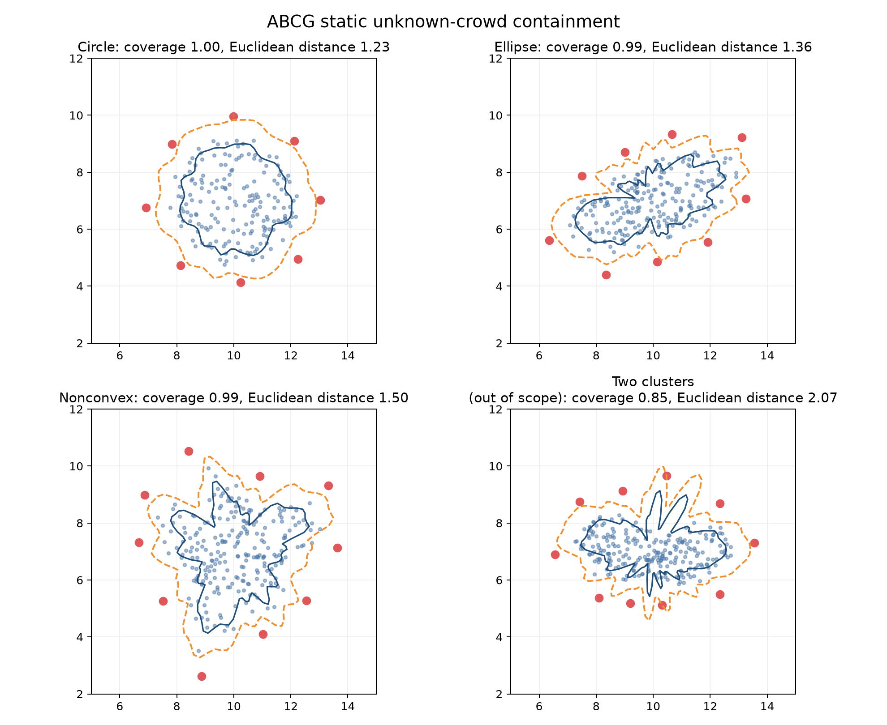
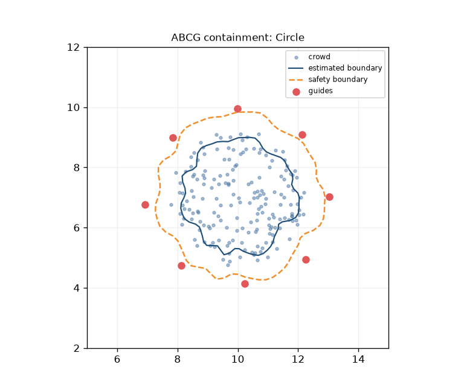
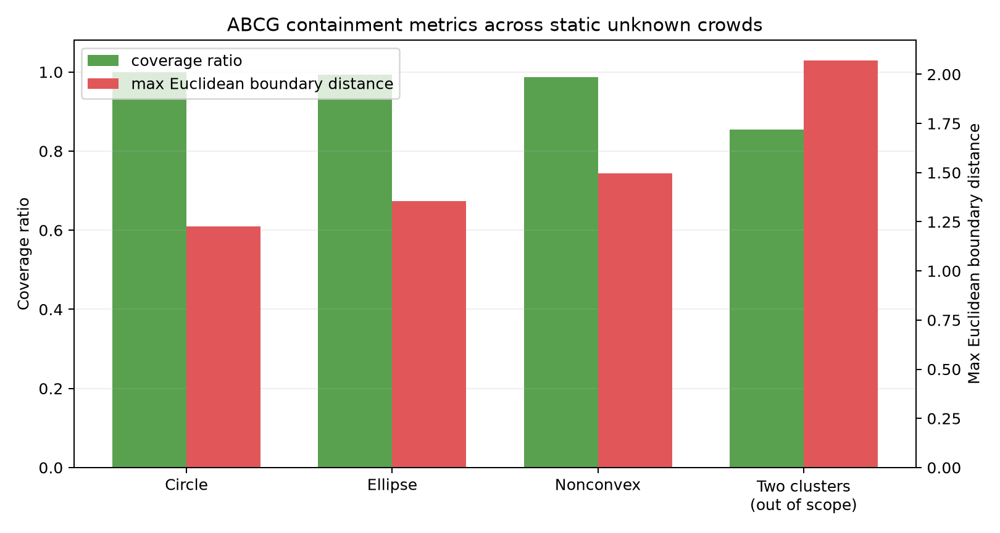

# Crowd Management

本專案已重構為研究「未知人群周圍 guide-agent 自適應部署」的模擬平台。

目前主線是 **ABCG: Adaptive Boundary-Coverage Guidance**：

PR6 已加入 alpha-shape 非凸邊界估計、bootstrap 不確定性、U/C 留出形狀各 30 個配對種子、消融、95% 信賴區間與失敗圖集。實作與評估證據已存在工作樹，但評估快照尚未來自凍結提交，因此 G6 的 frozen-commit 條件仍未滿足。

- 從未知靜態人群點雲估計人群中心與邊界。
- 在估計邊界外建立安全距離邊界。
- 使用 coverage control / CVT 風格方法部署多個 guide agents。
- 用 coverage ratio、maximum Euclidean boundary distance、radial deployment error、angular uniformity、guide-guide distance、guide-crowd safety violation 等指標評估。舊有 `max_boundary_gap` 僅為相容別名，並非弧長 gap。

## 目前素材

主 README 只展示新的 ABCG 素材。舊的 DBAct 圖片、GIF、影片素材已集中放入 `legacy/evacuation_guidance/`。







## 使用方式

新實驗入口：

```bash
python scripts/run_static_containment.py --config configs/static_crowd_circle.yaml --output runs/static_containment_circle --methods random static_circle legacy_center_radius abcg
```

執行 PR6 配對評估：

```bash
python scripts/run_step1_g6_compliance.py --output reports/step1_g6_compliance --run-root runs/step1_g6_compliance
```

重新生成 README 圖片與 GIF：

```bash
python scripts/build_readme_media.py
```

測試：

```bash
pytest --basetemp=.tmp/pytest-temp -o cache_dir=.tmp/pytest-cache
```

舊的疏散、DBACT、density-DBACT 實驗已移至：

```text
legacy/evacuation_guidance/
```

詳細英文說明見 [README.md](README.md)。
