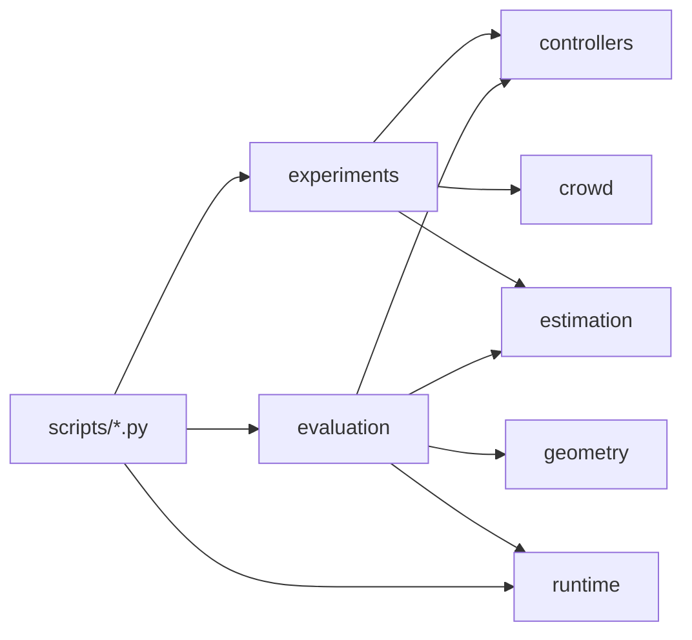

# Architecture audit and refactor plan

Branch: `maintenance-architecture-ci-v1`  
Base: `main` @ `93745582d849dafaa6251e9b2e12141be2117fe8`  
Scope: engineering refactor + README single source of truth + GitHub CI.  
**Not in scope:** G7 recovery, Step 2, merging `step1-proof-strengthening-v1` or `local-main-backup`.

## Current structure

```text
src/crowd_management/
  controllers/          # math controllers (ABCG, safety, assignment, …)
  estimation/           # boundary estimators (v1 + v2)
  geometry/             # arc-length / self-intersection
  crowd/                # static crowd generators + truth
  runtime/              # hardware, parallel plan, executor, BLAS limits
  evaluation/           # step1_g6.py (1561), step1_pr6.py (549) monoliths
  experiments/          # static_containment.py (789) monolith
  containment_metrics.py
  containment_visualization.py
  types.py

scripts/                # already-thin CLI wrappers for main runners
configs/
tests/
docs/
reports/                # frozen formal evidence (do not rewrite)
```



## Problem inventory

| ID | Finding | Severity | Notes |
| --- | --- | --- | --- |
| P1 | `evaluation/step1_g6.py` 1561 lines mixes case exec, aggregation, comparisons, I/O, preflight, report | **Critical** | Primary split target |
| P2 | `experiments/static_containment.py` 789 lines mixes runner, manifest, artifact writers | **High** | Split artifacts vs runner |
| P3 | `evaluation/step1_pr6.py` 549 lines similar mix at smaller scale | **High** | Share helpers with G6 |
| P4 | Duplicated `_polygon_*`, `_neutralize_confidence`, snapshot/JSON helpers | **High** | Extract shared modules |
| P5 | No `reporting/` package; schema strings scattered | **Medium** | Centralize jsonio + validation |
| P6 | README test counts conflict (77 / 95 / 168) | **High** | Badge + Dev Status stale |
| P7 | No GitHub Actions CI | **High** | Linux/Windows matrix needed |
| P8 | No Ruff / mypy configuration | **Medium** | Add scoped tooling |
| P9 | `boundary_v2.py` 846 / `abcg_v2.py` 796 / `safety.py` large | **Low this round** | **Math cores — do not refactor** |
| P10 | Functions >80 lines in orchestration | **Medium** | Shorten via extraction |
| P11 | Functions with >8 params (`_save_run_artifacts`, `_run_method`) | **Medium** | Bundle via dataclasses |
| P12 | High CC in `__post_init__` validators and orchestrators | **Medium** | Keep validators; shorten orchestrators |
| P13 | Nested depth 8 in `_build_manifest` | **Medium** | Split manifest builders |
| P14 | Large dict records with implicit keys | **Medium** | Add schema validation; TypedDict where cheap |
| P15 | Halfspace bitwise characterization fails 1 ULP on Linux | **High for CI** | Restore scalar-float distance path in vectorized builder (same math, same rows) |
| P16 | Plotting mixed into evaluators (failure gallery) | **Low** | Extract gallery helper; leave call sites |
| P17 | Public interfaces partially untyped | **Medium** | Annotate new/moved modules |
| P18 | Dead code / cyclic imports | **Low** | None found at package level |

## Target structure (this branch)

```text
src/crowd_management/
  runtime/                 # keep (already split)
  reporting/
    jsonio.py              # jsonable, write_json, records CSV
    snapshot.py            # repository / package / platform snapshot
    gallery.py             # failure gallery helpers
  evaluation/
    shared/
      polygons.py          # point-in-polygon + sampling primitives
      confidence.py        # neutralize_confidence
      curve_metrics.py
      stats.py             # bootstrap summaries
    schemas.py             # schema name constants + required keys
    schema_validation.py   # structural validators for formal outputs
    step1_g6/              # package replacing monolith
      config.py
      cases.py
      run_case.py
      aggregate.py
      ablations.py
      preflight.py
      report.py
      orchestrate.py
    step1_pr6/             # package (or lighter split)
      ...
    step1_g6.py            # thin re-export shim (compat)
    step1_pr6.py           # thin re-export shim (compat)
  experiments/
    static_containment/
      config.py
      methods.py
      artifacts.py
      runner.py
    static_containment.py  # thin re-export shim
  cli/                     # optional; scripts remain entrypoints
  controllers/ …           # UNCHANGED math
  geometry/ …              # UNCHANGED math
  estimation/ …            # UNCHANGED math
```

## Compatibility strategy

1. Keep `scripts/run_*.py` command lines and exit codes unchanged.
2. Keep public imports working:
   - `crowd_management.evaluation.run_g6_evaluation`
   - `crowd_management.evaluation.run_pr6_evaluation`
   - `crowd_management.experiments.static_containment.run_static_containment`
3. Temporary shim modules re-export the same names during/after the move.
4. Artifact filenames and JSON schema version strings stay stable.
5. No changes to frozen reports under `reports/step1_*`.

## Test protection strategy

1. Establish characterization/golden evidence before moves (smoke + schema + compare_results).
2. Full `pytest` after every commit.
3. `scripts/compare_results.py` for workers=1 vs auto scientific fields.
4. Do **not** enlarge float tolerances, delete cases, xfail, or skip slow tests.
5. Math-core files (`controllers/*`, `estimation/boundary_v2.py`, `geometry/*`) are touch-restricted; the only permitted safety touch is restoring the documented bitwise halfspace lock via scalar `float(np.linalg.norm(...))` distances (same constraints/order).

## Recommended commit order

1. docs: baseline + this plan
2. test: scientific characterization / schema / smoke scaffolding
3. fix: restore halfspace bitwise lock on Linux (scalar distances)
4. refactor: extract `reporting/` + evaluation shared helpers
5. refactor: split `static_containment` package
6. refactor: split `step1_pr6` package
7. refactor: split `step1_g6` package
8. docs: README single status + consistency checker
9. build: Ruff + scoped mypy
10. ci: Linux/Windows workflow
11. test: CI smoke workload + schema regression golden
12. docs: `refactor_result.md`

## Must not refactor (stable math cores)

- ABCG / ABCG-v2 control laws and episode semantics
- Boundary estimation math (`boundary.py`, `boundary_v2.py`)
- Periodic arc CVT / equal-arc planning
- Resource allocation and assignment costs
- Velocity safety projection formulation and emergency stop
- Success/failure/timeout classification and denominators
- Seeds, paired comparison definitions, formal record schemas
- Frozen experimental numbers in `reports/`

## High-risk areas (scientific results)

| Area | Risk | Mitigation |
| --- | --- | --- |
| Moving `_run_method` / episode loop | Record field drift | Characterization tests + compare_results |
| Aggregation / paired comparisons | Gate status flip | Lock aggregate JSON keys + values |
| JSON serialization of non-finite floats | Schema change | Shared `_jsonable` only |
| Parallel executor wiring | Ordering / exception swallow | Existing runtime tests + smoke workers=1 vs auto |
| Manifest SHA / freeze checks | Preflight false fail | Keep snapshot hashing identical |

## Explicitly out of scope this round

- Merging `step1-proof-strengthening-v1` or any G7 work
- Restoring evacuation / DBAct from `local-main-backup`
- Splitting `boundary_v2.py` / `abcg_v2.py` math modules
- Full-repo mechanical formatting
- Claiming CI runner timings as formal performance evidence
- Step 2 dynamic-crowd research
