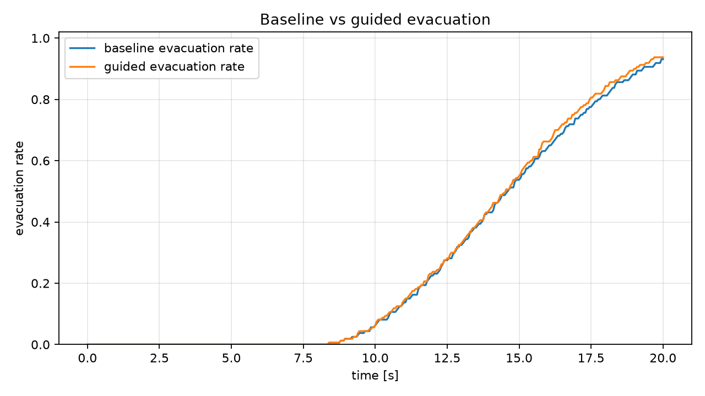

# First Demo Report

## Purpose

This demo tests whether the existing DBACT / cargo-guidance idea can be transferred to a simple crowd-management simulation with mobile guiders. The goal is not to solve the full crowd-management problem, but to produce a stable first feasibility result that can guide the next research sprint.

## Scope

- simple microscopic agent-based crowd model
- guider-based guidance
- no exclusion queue
- no hybrid model
- no CBF
- no LLM

## Simulation Setup

- Config file: `configs/simple_room.yaml`
- Pedestrian count: 160
- Room size: 20.0 m x 12.0 m
- Exit setting: right-side exit centered at y = 6.0 m, width = 2.0 m
- Guider count: 5 in the guided run
- Simulation steps: 400
- Time step: 0.05 s
- Final simulated time: 20.00 s

## Method

Baseline: pedestrians move toward the exit without guidance, using the microscopic social-force-like model with goal attraction, pedestrian-pedestrian repulsion, wall handling, speed limits, and evacuation detection.

Guided: the DBACT-transfer controller estimates the active crowd center and spread, places mobile guiders behind and beside the active crowd, and lets nearby pedestrians blend their exit-seeking direction with the guider-suggested direction according to influence and compliance.

## Metrics

| Metric | Baseline | Guided |
|---|---:|---:|
| Final evacuation rate | 0.93125 | 0.93750 |
| Final evacuated | 149 | 150 |
| Mean speed | 1.05445 | 1.05781 |
| Mean congestion index | 1.51381 | 1.61035 |
| Peak near-collision count | 246 | 246 |
| Mean path length | 16.68246 | 16.72593 |
| Full evacuation time | not reached | not reached |

Additional comparison values:

- delta_final_evacuation_rate: +0.00625
- delta_mean_active_speed_over_time: +0.00336
- delta_peak_congestion_index: +0.00000

## Visualization

Final snapshots are also saved for inspection:

- `baseline_final_snapshot.png`
- `guided_final_snapshot.png`

## Observations

The guided run shows a small positive feasibility signal: the final evacuation rate and mean speed are slightly higher than the baseline. However, the improvement is modest, full evacuation is not reached within this scenario, and congestion-related indicators are not clearly improved. This suggests that the current transfer pipeline works technically, while the guider-pedestrian interaction model still needs stronger validation and tuning.

The important result for this stage is that the simulator, DBACT-transfer controller, metrics, and visualization pipeline run end-to-end in a reproducible Conda environment.

## Next Steps

1. Add static and random guider baselines.
2. Improve the guider-pedestrian interaction model with stronger distance-based blending and compliance tuning.
3. Test two-exit or narrow-exit scenarios where guidance has a clearer behavioral role.
