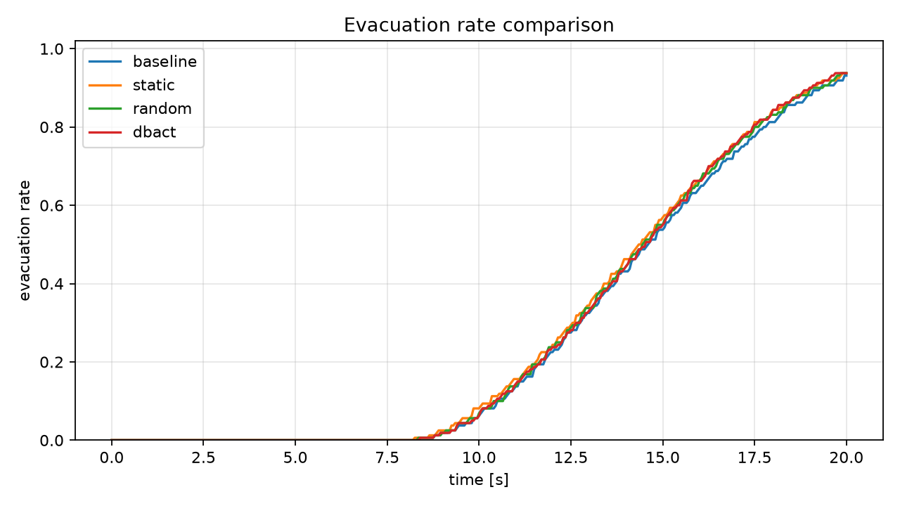

# Guidance Baselines Report

## Purpose

This stage tests whether DBACT-transfer guidance is better than simpler guider baselines. The goal is to separate the value of the transferred cargo-guidance placement rule from the generic effect of simply adding guiders.

## Scope

- simple microscopic agent-based crowd model
- guider-based guidance
- no exclusion queue
- no hybrid model
- no CBF
- no LLM
- no real-robot or hardware experiment

## Scenarios

The completed comparison uses `configs/simple_room.yaml`, the same stable one-exit scenario used for the first demo.

A prepared future scenario is also included at `configs/two_exits.yaml`. The current simulator still uses the primary one-exit mechanism, so the two-exit file is documented as a prepared next scenario rather than a fully used multi-exit model.

## Guidance Modes

- `baseline`: no guidance; pedestrians move toward the exit using the microscopic crowd model.
- `static`: fixed guider placement; guiders stay at fixed positions between the initial crowd and the exit.
- `random`: random moving guiders; guiders periodically choose reproducible random targets inside the room.
- `dbact`: dynamic DBACT-transfer guider placement; guiders estimate crowd center/spread and move around the active group.

## Simulation Setup

- Config file: `configs/simple_room.yaml`
- Room size: 20.0 m x 12.0 m
- Pedestrian count: 160
- Guider count: 5 for static, random, and dbact runs
- Simulation steps: 400
- Time step: 0.05 s
- Exit: right-side exit centered at y = 6.0 m, width = 2.0 m

## Metrics

| Metric | Baseline | Static | Random | DBACT |
|---|---:|---:|---:|---:|
| Final evacuated | 149 | 150 | 150 | 150 |
| Final evacuation rate | 0.93125 | 0.93750 | 0.93750 | 0.93750 |
| Mean speed | 1.05445 | 1.06463 | 1.05412 | 1.05781 |
| Congestion index | 1.51381 | 1.48335 | 1.60127 | 1.61035 |
| Near-collision count | 246 | 246 | 246 | 246 |
| Mean path length | 16.68246 | 16.69643 | 16.69999 | 16.72593 |
| Full evacuation time | not reached | not reached | not reached | not reached |

## Results

Evacuation-rate comparison:

Final metric comparison:

The machine-readable summary is saved in `summary.json`, and the table source is saved in `metrics_comparison.csv`.

## Observations

All guider methods produce the same small final-evacuation-rate improvement over no guidance, so this run does not prove that DBACT-transfer placement is better than simpler guider baselines. Static guidance has the strongest mean-speed and congestion results in this scenario, while DBACT has slightly higher mean speed than random but higher congestion. This suggests that the current transfer pipeline works technically, but the guider-pedestrian interaction and placement logic are still too simple to create a clear DBACT-specific advantage.

This should not be reported as a solved crowd-management method. It is a controlled baseline experiment showing that the simulator can compare no guidance, simple guider baselines, and DBACT-transfer guidance under the same metrics.

## Failure / Limitation

The current one-exit scenario is too simple to strongly expose crowd-management value. In addition, the current pedestrian response to guiders is only a local directional influence. It does not yet model stronger route choice, leader following, group splitting, or two-exit assignment.

## Next Steps

1. Improve the guider-pedestrian influence model.
2. Test two-exit and narrow-exit scenarios.
3. Tune influence radius, compliance, and guider count.
4. Prepare concise progress slides from these comparison results.
